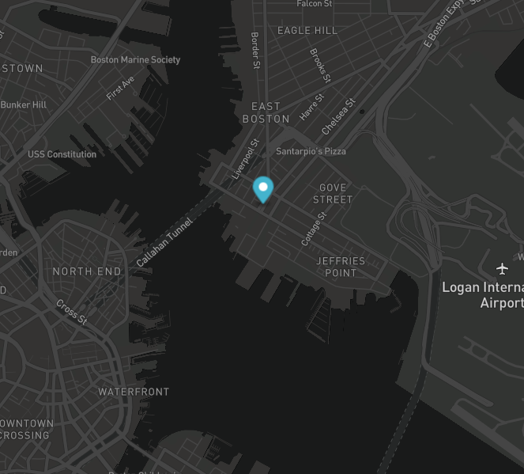

# Real Time Bus Tracker

# Description

From the **MITxPro Full Stack Development** program I present to you the project "Real Time Bus Tracker". This program will let you track a random bus from the bus system in Boston, Massachussets. This repository features the usage of JavaScript, the leveraging of API's and CSS styling for looks and object placement. At the click, a random marker will be generated indicating the location of a bus. The marker will be updated every 15 seconds leaving a trail of the route that the bus is currently in. The program will best perform during the times the bus system is the most active (rush hours). 

***How to run:*** Once the repository is deployed (https://dfgav1r1a.github.io/bustracker) a map of the City of Boston will be displayed. On the upper left corner of your display you will find the button "Start Tracking". To start tracking a bus, click on the button. You will notice that a marker will be generated and added to the map. This marker will be updated every 15 seconds following the direction that the bus is currently taking. To clear/restart, please press the key "F5" on your keyboard or reload the page using your browser.

## Improvement Roadmap

1. Change the looks of the marker.
2. Add a more thorough GUI where the user can choose the route he/she wants to track.
3. Add a line that tracks the route that the bus is currently in instead of the marker's track.
4. Add the routes: Upon user's input, the map could show the loop of the route
5. Add information to the marker: At mouse click, a card will be displayed giving information about the bus. route number and current position.  

# MIT License

Copyright (c) 2020

Permission is hereby granted, free of charge, to any person obtaining a copy
of this software and associated documentation files (the "Software"), to deal
in the Software without restriction, including without limitation the rights
to use, copy, modify, merge, publish, distribute, sublicense, and/or sell
copies of the Software, and to permit persons to whom the Software is
furnished to do so, subject to the following conditions:

The above copyright notice and this permission notice shall be included in all
copies or substantial portions of the Software.

THE SOFTWARE IS PROVIDED "AS IS", WITHOUT WARRANTY OF ANY KIND, EXPRESS OR
IMPLIED, INCLUDING BUT NOT LIMITED TO THE WARRANTIES OF MERCHANTABILITY,
FITNESS FOR A PARTICULAR PURPOSE AND NONINFRINGEMENT. IN NO EVENT SHALL THE
AUTHORS OR COPYRIGHT HOLDERS BE LIABLE FOR ANY CLAIM, DAMAGES OR OTHER
LIABILITY, WHETHER IN AN ACTION OF CONTRACT, TORT OR OTHERWISE, ARISING FROM,
OUT OF OR IN CONNECTION WITH THE SOFTWARE OR THE USE OR OTHER DEALINGS IN THE
SOFTWARE.
